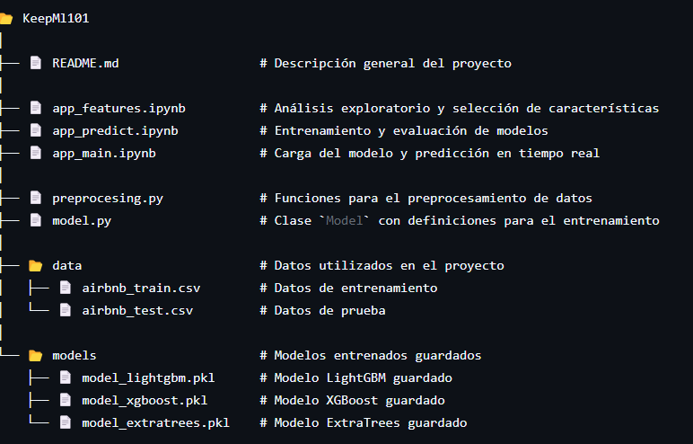

# Predicción del Precio de una Habitación

En este proyecto se crea un modelo que pueda predecir el **precio de una habitación**.

## Proceso

1. **Estudio de las Features**  
   El proceso inicia con el análisis de las características (**features**) con el objetivo de determinar cuáles explican mejor la varianza de nuestra variable objetivo. 

2. **Aplicación de Técnicas**  
   Durante este análisis se aplican diversas técnicas, las cuales se encuentran recogidas en el módulo `app_features`.

3. **Obtención del Modelo**  
   Posteriormente, se lleva a cabo el análisis para la construcción del modelo en el módulo `app_predict`.

## Resultados

- Se obtuvieron varios modelos y el mejor de ellos alcanzó un **R² de 0.78**.  
- Sin embargo, este modelo no es capaz de **generalizar bien**.

## Implementación en `app_main`

En el módulo `app_main` se realiza lo siguiente:
1. Se **carga el modelo creado**.
2. Se realiza una **predicción**.
3. Se vuelve a **evaluar el modelo** para verificar su rendimiento.

## 🏨 Estructura del Proyecto: Predicción del Precio de una Habitación

## 🛠️ Tecnologías Utilizadas

- **Python**: Lenguaje de programación principal para el desarrollo del proyecto.
- **Jupyter Notebooks**: Herramienta para desarrollo interactivo y análisis de datos.
- **Scikit-Learn**: Librería para preprocesamiento de datos, entrenamiento de modelos de regresión y evaluación de resultados.
- **XGBoost**: Algoritmo de ensamble basado en boosting, eficiente y preciso para tareas de regresión.
- **ExtraTrees**: Algoritmo de ensamble basado en bagging con árboles de decisión.
- **Random Forest**: Modelo de ensamble robusto para reducir el sobreajuste y mejorar la precisión.
- **BaggingRegressor**: Modelo de ensamble basado en bagging para reducir la varianza y mejorar la estabilidad.
- **ElasticNet**: Modelo de regresión lineal con regularización L1 y L2 para evitar el sobreajuste.
- **PCA (Análisis de Componentes Principales)**: Técnica de reducción de dimensionalidad para optimizar el rendimiento de los modelos.
- **Pandas**: Librería para manipulación y análisis de datos en formato tabular.
- **NumPy**: Librería para operaciones numéricas y matrices.
- **Matplotlib** / **Seaborn**: Herramientas para visualización de datos y gráficos.
- **Pickle**: Librería para serialización y deserialización de modelos entrenados.

**Entre otras.**

